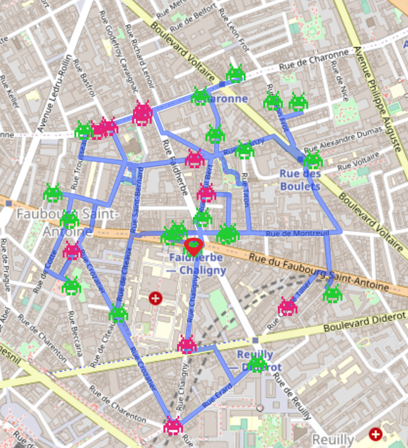

# Invaders
### Geolocation and Invaders trip 

Using a list of invaded address in Paris, geolocate them on a map, and draw dedicated Invaders trail per district.

  

**[NEW]** You can now use Trip.R to get an automated trip based on the input address and # of invaders you wan't to get. 

   

Things to be added : 
- possibility to include or not invaders already flashed
- implement the traveller salesman algorithm to optimize route
- embed the code in shiny.io

---
Previous manual trips based on [https://umap.openstreetmap.fr/](https://umap.openstreetmap.fr/)    

1st Trail : [Paris-Nation-to-Austerlitz]   
2nd Trail : [Paris-Buttes-Chaumont]  
3rd Trail : [Paris-Saint-Germain-Odéon](https://umap.openstreetmap.fr/fr/map/rando-invaders-003_231138#15/48.8557/2.3375)  
4th Trail : [Paris-Europe]   
5th Trail : [Paris-Charonne](https://umap.openstreetmap.fr/fr/map/rando-invader-005_231133#15/48.8583/2.4046)   
6th Trail : [Paris-Gobelins-Butte-aux-Cailles](https://umap.openstreetmap.fr/fr/map/rando_invaders_6_251826) From Cardinal Lemoine (M10) to Corvisard (M6)   

